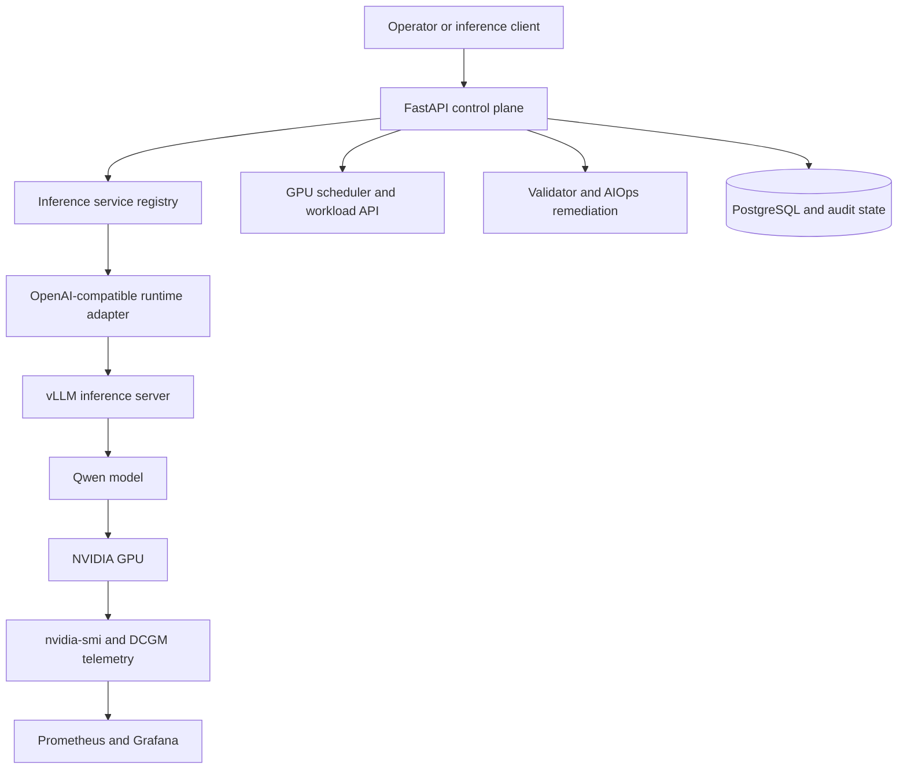

# GPU Cluster Reliability Control Plane

An NVIDIA GPU cluster operations and LLM inference platform built around a clear separation between the control plane and the data plane.

The project started as a GPU-cluster reliability system: discover GPUs, admit workloads, observe health, detect failures, and perform controlled remediation. It has since been extended into a working single-GPU inference platform that deploys Qwen through vLLM, exposes OpenAI-compatible chat APIs, streams tokens, and measures inference performance.

The result is a practical portfolio project for GPU infrastructure, Kubernetes, inference serving, and reliability engineering.

## What this project demonstrates

- Real NVIDIA GPU discovery through `nvidia-smi`
- Simulated multi-node mode for development without a GPU cluster
- GPU-aware workload admission and priority scheduling
- CUDA smoke workloads and Kubernetes GPU Jobs
- GPU health validation and failure injection
- Evidence-based AIOps remediation with allow-listed actions
- PostgreSQL-ready workload, incident, and audit persistence
- Kubernetes custom resources and Lease-based controller leadership
- Real LLM serving with vLLM on an RTX 5070 Ti
- OpenAI-compatible chat completions and SSE streaming
- TTFT, TPOT, tokens/sec, latency, and token accounting
- Prometheus-compatible metrics and a Grafana inference dashboard

## Why this project exists

Research teams need reliable access to GPU clusters without manually inspecting every node or debugging every failed workload. This project provides a small but realistic control plane that:

- discovers NVIDIA GPUs through `nvidia-smi` in real mode;
- supports a simulated multi-node mode for development;
- schedules GPU jobs based on available capacity and priority;
- runs a CUDA matrix-multiplication smoke workload;
- records jobs, incidents, and audit events in PostgreSQL;
- injects GPU-memory pressure to exercise failure handling;
- detects incidents and executes drain/recovery actions through an AIOps agent;
- exposes a FastAPI API and operator dashboard;
- runs locally with Docker Compose or on Kubernetes/k3s.


## Architecture at a glance



The platform now manages two related workload paths:

```text
Batch path:      API → scheduler → CUDA/Kubernetes workload → GPU
Inference path:  API → service registry → vLLM → model → GPU → streamed tokens
Reliability:     telemetry → validator → AIOps action → audit state
```

## Control plane and data plane

The control plane decides what should happen. It handles GPU inventory,
admission, scheduling, health, remediation, service registration, and metrics.

The data plane performs the work. It includes the CUDA workers and the vLLM
server that loads the Qwen model and generates tokens on the NVIDIA GPU.

```text
Client
  ↓
FastAPI control plane :8001
  ├── service registry
  ├── GPU health and scheduling
  ├── audit and metrics
  └── runtime adapter
          ↓
    vLLM data plane :8002
          ↓
    Qwen model on NVIDIA GPU
```

This separation lets the project manage inference without embedding model
execution inside the control-plane process.

## Engineering journey

### GPU reliability foundation

The original platform established the operational foundation: discover GPUs,
admit workloads by capacity and priority, execute CUDA smoke tests, refresh
telemetry, detect abnormal conditions, and perform controlled recovery actions.

### Inference service abstraction

Inference was added as a first-class workload boundary. An inference service
contains a model, runtime, endpoint, replica count, GPU count, lifecycle state,
request counters, token counters, and recent performance measurements.

The runtime boundary supports a deterministic mock runtime for CPU development
and an OpenAI-compatible adapter for vLLM, SGLang, TGI, or another compatible
server.

Chat requests now make a routing decision before invoking the selected service
runtime. The selected logical replica and policy are returned in response
metadata and headers. With one real GPU, all logical replicas may still point
to the same vLLM backend; the decision path is real while fleet capacity is
simulated.

### Real vLLM serving

The local deployment runs `Qwen/Qwen2.5-1.5B-Instruct` through vLLM in a
GPU-enabled Docker container. FastAPI routes requests to vLLM and returns either
a complete OpenAI-compatible response or an SSE stream.

### Performance measurement

The service records time to first token (TTFT), time per output token (TPOT),
tokens per second, request duration, prompt tokens, completion tokens, request
count, and error count. These measurements create a baseline for future
runtime, batching, and multi-GPU comparisons.

### Inference health monitoring

The control plane can actively check an inference backend. For an
OpenAI-compatible service, the health probe calls the backend `/health`
endpoint, tracks health-check failures, records in-flight requests and queue
depth, and marks the service `ready` or `unavailable`. These signals are
exposed through the service API and Prometheus metrics. The local implementation
uses one real vLLM backend; independent multi-process replica deployment remains
future work.

### Inference routing policies

The control plane now includes a routing-decision layer with three policies:

- `round-robin`: rotate across ready logical replicas;
- `load-aware`: choose the replica with the lowest queue depth;
- `kv-cache-aware`: prefer the highest reported KV-cache utilization when queue
  depth is comparable.

On the local workstation these are logical replicas used to evaluate routing
behavior. They do not imply that three independent vLLM processes are running
on one GPU. The routing API returns the policy, selected replica, decision
reason, queue depth, and KV-cache signal used by the decision.

The repository also includes a concurrent routing benchmark:

```bash
python -m app.routing_benchmark
```

The benchmark compares decision throughput and replica distribution for all
three policies. It measures the router, not model-generation throughput.

### Persistence, draining, and admission control

Inference service definitions and routing signals are persisted in the local
SQLite/PostgreSQL-compatible database and rehydrated when the API starts. A
failed health check removes a service's logical replicas from routing. Repeated
runtime failures automatically stop the service after the configured threshold.
Inference requests also have a bounded concurrency admission limit; requests
that exceed it receive backpressure instead of being sent blindly to the
runtime.

The current V2 control-plane path is:

```text
request → routing policy → selected logical replica → vLLM runtime
        → TTFT/TPOT/tokens/sec + vLLM queue/KV-cache metrics
        → health decision → route away or drain after repeated failures
```

The implementation also includes service/replica state rehydration from the
database, a concurrent routing-policy benchmark, and bounded request
admission with HTTP backpressure. On one GPU, logical replicas share the same
real vLLM backend; distributed capacity and independent model processes remain
simulation boundaries.

## Runtime modes

### Real GPU mode

Used by the native k3s deployment. The application executes `nvidia-smi` to discover the host GPU and refresh memory, utilization, temperature, power, driver, and CUDA information.

The Kubernetes deployment target uses:

- native k3s inside Ubuntu 24.04 on WSL2;
- NVIDIA Container Toolkit;
- NVIDIA Kubernetes device plugin;
- `runtimeClassName: nvidia`;
- Kubernetes extended resource `nvidia.com/gpu`.

The measured local inference run used Docker Desktop GPU support on an NVIDIA
GeForce RTX 5070 Ti.

### Simulated mode

Used by the CPU Docker Compose profile and Docker Desktop Kubernetes demonstrations. It creates deterministic simulated nodes and GPUs so the API, scheduler, incident workflow, and dashboard can be developed without a GPU cluster.

## Main capabilities

### GPU inventory and telemetry

The cluster adapter reports node state and per-GPU telemetry. In real mode, values come from `nvidia-smi`; in simulated mode, values come from the in-memory test cluster.

### GPU-aware scheduling

Jobs declare a GPU count and priority. The scheduler selects a ready node with sufficient free GPUs, marks the workload as running, and releases capacity when the workload completes or is cancelled.

### CUDA workload execution

The dashboard can submit a CUDA job and launch the packaged GPU worker. The worker performs a matrix-multiplication smoke test, making GPU execution visible in the application lifecycle and with `nvidia-smi`.

### Reliability and AIOps

Operators can inject GPU-memory pressure. The validator turns abnormal telemetry into incidents with evidence and a recommended action. The AIOps agent reconciles incidents and records remediation actions such as `drain_node_and_clear_workloads`.

### Measured reliability experiment

The repository includes a repeatable CPU-only experiment that models a running
GPU workload, injects memory pressure, detects the resulting incident, marks
the node draining, requeues the affected workload, recovers the node, and
checks healthy control trials for false positives:

```bash
python -m app.reliability_experiment
```

The output reports failure-detection latency, drain-initiation latency,
recovery time, workloads affected, and false-positive rate. These are
control-plane measurements in the simulated cluster, not claims about physical
GPU reset or production fleet recovery time. A representative local run is:

```text
trials: 5
workloads_affected: 1
false_positive_rate: 0.0
```

The exact timing values are machine-dependent and should be captured when the
experiment is run.

### Inference service foundation

The control plane also exposes a first inference-service boundary. Services can
use the deterministic `mock` runtime for CPU development or an
`openai-compatible` runtime for vLLM, SGLang, TGI, or another compatible
server. This milestone supports service registration, lifecycle state,
 chat completions, SSE streaming, token/request counters, and basic latency/
 throughput metrics. Continuous batching and Kubernetes model lifecycle
 management are next steps.

Example local flow:

```bash
curl -X POST http://localhost:8000/api/v1/inference/services \
  -H 'content-type: application/json' \
  -d '{"name":"rick","model":"llama-3.1-8b","runtime":"mock"}'

curl -X POST http://localhost:8000/api/v1/inference/services/rick/chat/completions \
  -H 'content-type: application/json' \
  -d '{"messages":[{"role":"user","content":"Hello"}]}'
```

To deploy the first real vLLM backend on Kubernetes, apply the platform,
database, and inference manifests in the `gpuops` namespace:

```bash
kubectl apply -f deploy/postgres.yaml
kubectl apply -f deploy/k8s.yaml
kubectl apply -f deploy/inference-vllm.yaml
kubectl -n gpuops rollout status deployment/vllm-inference --timeout=10m
```

The API deployment receives the internal vLLM endpoint through
`INFERENCE_ENDPOINT`. Register the service after the vLLM pod is ready:

```bash
curl -X POST http://127.0.0.1:8003/api/v1/inference/services \
  -H 'content-type: application/json' \
  -d '{"name":"qwen","model":"Qwen/Qwen2.5-1.5B-Instruct","runtime":"vllm","gpu_count":1}'
```

For gated Hugging Face models, create the optional token secret before applying
the vLLM deployment:

```bash
kubectl -n gpuops create secret generic huggingface-token \
  --from-literal=HF_TOKEN="$HF_TOKEN"
```

The manifest uses `vllm/vllm-openai:latest` for an initial smoke test. Pin a
tested vLLM image tag and use persistent model storage before production use.

The observability manifest now provisions Prometheus scraping plus a Grafana
`GPUOps Inference` dashboard for request rate, TTFT, TPOT, tokens/sec, GPU
utilization, and GPU memory. Apply it after the platform service is available:

```bash
kubectl apply -f deploy/observability.yaml
kubectl -n monitoring port-forward service/grafana 3000:3000
```

Open `http://127.0.0.1:3000` and select the provisioned `GPUOps Inference`
dashboard.

### Local GPU inference quickstart

On a Windows workstation with Docker Desktop GPU support:

```powershell
$env:CLUSTER_MODE = "real"
py -3 -m venv .venv
.\.venv\Scripts\python.exe -m pip install -r requirements.txt
.\.venv\Scripts\python.exe -m uvicorn app.api:app --host 127.0.0.1 --port 8001
```

In a second terminal, start vLLM:

```powershell
docker run --rm `
  --name vllm-qwen `
  --gpus all `
  --ipc=host `
  -p 8002:8000 `
  vllm/vllm-openai:latest `
  --model Qwen/Qwen2.5-1.5B-Instruct `
  --served-model-name Qwen/Qwen2.5-1.5B-Instruct `
  --host 0.0.0.0 `
  --port 8000 `
  --max-model-len 4096 `
  --gpu-memory-utilization 0.90
```

Register the service through `/docs`, then send a request to
`/api/v1/inference/services/local-qwen/chat/completions`. Use
`{"stream":true}` to receive server-sent events. View the resulting metrics at
`/metrics`.

### Observed local result

The first real local inference run produced this smoke-test sample:

| Metric | Observed value |
|---|---:|
| GPU | NVIDIA GeForce RTX 5070 Ti |
| Model | Qwen 2.5 1.5B Instruct |
| Requests | 2 |
| Errors | 0 |
| Prompt tokens | 72 |
| Completion tokens | 509 |
| TTFT | 0.318 seconds |
| TPOT | 0.006 seconds/token |
| Throughput | 165.55 tokens/sec |
| Latest request duration | 0.771 seconds |
| GPU memory observed | 14,488 MB |

These are workstation smoke-test measurements, not production benchmarks. They
demonstrate that the complete control-plane-to-GPU inference path is working
and measurable.

### Latest local inference-health validation

After restarting the control plane, registering `local-qwen`, probing the vLLM
health endpoint, and sending a streamed request, the service reported:

| Signal | Observed value |
|---|---:|
| Service state | `ready` |
| Health checks | 1 |
| Health failures | 0 |
| Requests | 2 |
| Request errors | 0 |
| Queue depth | 0 |
| TTFT | 0.282 seconds |
| TPOT | 0.00898 seconds/token |
| Generated token rate | 111.42 tokens/sec |
| Latest request duration | 0.623 seconds |

This validates the local health-probe, streaming, and performance-accounting
path on one RTX 5070 Ti. The numbers are a workstation smoke-test sample, not
a production SLO or multi-replica benchmark.

### V2 implementation results

The V2 control-plane extensions were validated locally with the following
checks:

- **18 automated tests passed** across scheduling, failure recovery, inference
  health, streaming, routing, vLLM metric parsing, draining, persistence
  behavior, admission limits, and the reliability experiment.
- **Reliability experiment:** 5 trials, 5 healthy control trials, 1 workload
  affected, and 0% false positives. Detection, drain initiation, and recovery
  were all measured in the simulated control-plane path; these microsecond-scale
  values are not production recovery SLOs.
- **Persistence:** service definitions and logical replica state were reloaded
  after an API restart using the local database-backed persistence path.
- **Routing:** the real chat path makes a routing decision before sending the
  request to the model runtime. Routing decisions expose the selected replica,
  policy, queue depth, KV-cache signal, and execution mode.

The concurrent logical-router benchmark ran 100 decisions with 8 workers:

| Policy | Duration | Decisions/sec | Distribution |
|---|---:|---:|---|
| Round robin | 0.002408 s | 41,524.79 | 34 / 33 / 33 |
| Load aware | 0.001632 s | 61,270.76 | 100% replica-1 |
| KV-cache aware | 0.002099 s | 47,637.20 | 100% replica-1 |

The benchmark measures routing-control-plane decisions, not end-to-end model
generation. The three replicas are logical replicas on one GPU, so these results
demonstrate policy behavior and concurrency handling rather than independent
GPU capacity.

### Single-GPU inference benchmark suite

The next measurement milestone is a reproducible workload benchmark against the
live control-plane-to-vLLM path. The benchmark varies concurrency and prompt
length, captures streaming TTFT, TPOT, generated-token throughput, P95 request
latency, success rate, queue depth, and best-effort GPU/KV-cache telemetry.

Run it after starting the API and registering `local-qwen`:

```powershell
python -m app.inference_benchmark `
  --service local-qwen `
  --concurrency 1,4,8,16 `
  --prompt-tokens 128,2048 `
  --requests 16 `
  --max-tokens 64 `
  --runtime-metrics-url http://127.0.0.1:8002/metrics `
  --output benchmark-results.json `
  --csv benchmark-results.csv
```

The benchmark was run on the local NVIDIA GeForce RTX 5070 Ti. The measured
results are:

| Concurrency | Prompt tokens | TTFT | TPOT | Throughput | P95 | GPU util avg/max | KV cache max |
|---:|---:|---:|---:|---:|---:|---:|---:|
| 1 | 125 | 0.327 s | 5.43 ms | 94.0 tok/s | 0.705 s | 45.5% / 87% | 0.05% |
| 4 | 125 | 0.388 s | 5.61 ms | 87.8 tok/s | 0.754 s | 27.5% / 55% | 0.05% |
| 8 | 125 | 0.553 s | 5.21 ms | 72.6 tok/s | 0.881 s | 0% / 0%* | 0.05% |
| 16 | 125 | 0.624 s | 5.40 ms | 66.3 tok/s | 0.964 s | 26% / 26%* | 0.04% |
| 1 | 1,566 | 0.325 s | 5.43 ms | 33.0 tok/s | 0.433 s | 9.5% / 61% | 0.41% |
| 4 | 1,566 | 0.385 s | 5.48 ms | 26.8 tok/s | 0.482 s | 0% / 0%* | 0% |
| 8 | 1,566 | 0.420 s | 5.44 ms | 28.7 tok/s | 0.600 s | 23% / 23%* | 0% |
| 16 | 1,566 | 0.640 s | 5.74 ms | 15.7 tok/s | 0.708 s | 40% / 40%* | 0% |

All 128 requests succeeded. Queue depth remained zero. The requested `2,048`
token prompt generated `1,566` actual runtime tokens, so the observed token
count—not the target label—should be used when comparing workloads. KV-cache
utilization remained below 0.5% for this small model and short `max_tokens=64`
workload.

The rows marked `*` had only one or two 250-ms telemetry samples because the
workload completed quickly; their latency and throughput values are usable, but
their GPU-utilization averages are directional rather than a full time-series
profile. The benchmark also uses a non-streaming calibration request to obtain
the authoritative prompt-token count because streamed usage coverage is not
consistent at higher concurrency.

The benchmark reports the runtime's actual prompt-token count when streamed
usage is available; the prompt target is only a reproducible workload label.
Increasing concurrency should be interpreted alongside admission rejections,
queue depth, KV-cache pressure, and P95 latency—not throughput alone.

### Persistence and auditability

PostgreSQL stores job, incident, and audit records. This gives the demo an operational history instead of relying only on transient console output.

## Repository layout

```text
app/
  api.py                    FastAPI routes and lifecycle
  inference.py              Inference service registry and runtime adapters
  routing.py                Round-robin, load-aware, and KV-cache-aware routing
  routing_benchmark.py       Concurrent routing-policy benchmark
  cluster.py                Real/simulated GPU discovery and telemetry
  scheduler.py              GPU-aware job admission and lifecycle
  agent.py                  Reliability reconciliation logic
  validator.py              Health and incident validation
  reliability_experiment.py Repeatable failure/recovery benchmark
  persistence.py            PostgreSQL persistence and audit events
  gpu_worker.py             CUDA workload worker
  kubernetes_adapter.py     Kubernetes integration boundary
  static/index.html         Operator dashboard

controllers/
  reliability_controller.py Kubernetes reliability controller
  workload_controller.py    GpuWorkload reconciler and Lease leadership

training/
  train.py                  GPU training smoke workload

deploy/
  docker-compose.yml        CPU and GPU Compose services
  Dockerfile.gpu            NVIDIA CUDA runtime image
  gpuworkload-crd.yaml      GpuWorkload custom resource definition
  k8s.yaml                  API Deployment and Service
  postgres.yaml              PostgreSQL StatefulSet and Service
  controller.yaml            RBAC and reliability controller
  training-job.yaml          Kubernetes GPU training Job
  observability.yaml         Observability resources
  inference-vllm.yaml        GPU-backed vLLM deployment and service
```

## Run the real GPU Kubernetes demo

These commands target the native k3s cluster inside Ubuntu WSL2. Keep the existing project directory on Windows; WSL accesses it through `/mnt/c`.

```bash
cd "/mnt/c/Users/Junie/Downloads/GPU Cluster Reliability Control Plane"

# The image must already be imported into k3s containerd.
sudo k3s kubectl apply -f deploy/postgres.yaml
sudo k3s kubectl apply -f deploy/gpuworkload-crd.yaml
sudo k3s kubectl apply -f deploy/k8s.yaml
sudo k3s kubectl apply -f deploy/controller.yaml

sudo k3s kubectl get pods -n gpuops
sudo k3s kubectl exec -n gpuops deployment/gpu-cluster-ops -- nvidia-smi

sudo k3s kubectl port-forward \
  --address 0.0.0.0 \
  -n gpuops service/gpu-cluster-ops 8003:8000
```

Open `http://127.0.0.1:8003` in a browser.

## Run the Docker Compose GPU demo

```powershell
cd "C:\Users\George\Downloads\GPU Cluster Reliability Control Plane"
docker compose -f deploy/docker-compose.yml down
docker compose -f deploy/docker-compose.yml --profile gpu up --build
```

The Compose GPU service is exposed at `http://127.0.0.1:8002`.

## Demo script

1. Open the dashboard and show the RTX 5070 Ti inventory.
2. Submit a CUDA job and run it.
3. Show the job transition to `succeeded`.
4. Click **Inject GPU pressure**.
5. Click **Run AIOps reconcile**.
6. Show the incident evidence and remediation action.
7. Register a mock or vLLM inference service and send a chat completion.
8. Repeat with `stream: true` and inspect TTFT, TPOT, tokens/sec, and GPU metrics.
9. Explain that Kubernetes handles placement and GPU allocation while the application provides the control-plane and reliability workflow.

## API surface

| Endpoint | Purpose |
|---|---|
| `GET /api/v1/cluster/health` | Aggregate cluster health |
| `GET /api/v1/nodes` | Node and GPU inventory |
| `GET /api/v1/jobs` | List jobs and states |
| `POST /api/v1/jobs` | Submit a GPU job |
| `POST /api/v1/jobs/{id}/execute` | Launch CUDA execution |
| `POST /api/v1/jobs/{id}/cancel` | Cancel a running job |
| `POST /api/v1/jobs/{id}/checkpoint` | Record checkpoint metadata and requeue state |
| `POST /api/v1/failures` | Inject a test failure |
| `POST /api/v1/agent/reconcile` | Detect and remediate incidents |
| `POST /api/v1/inference/services` | Register an inference service |
| `GET /api/v1/inference/services` | List inference services |
| `GET /api/v1/inference/services/{name}` | Inspect service state and performance |
| `GET /api/v1/inference/services/{name}/health` | Probe backend health and update service state |
| `POST /api/v1/inference/services/{name}/route` | Compare routing policies using logical replica metrics |
| `POST /api/v1/inference/services/{name}/chat/completions` | Send a chat completion request; supports `stream: true` |
| `POST /api/v1/inference/services/{name}/stop` | Stop an inference service |
| `GET /metrics` | Prometheus-compatible metrics |

Interactive API documentation is available at `/docs`.


## Limitations and production next steps

This is a portfolio-scale platform, not a replacement for a production scheduler or managed AI cloud. The project has durable database records, idempotency metadata, a Kubernetes workload CRD, and Lease-based controller leadership. The in-process scheduler and runtime execution are intentionally simplified, while inference-service and logical-replica definitions now rehydrate from durable state.

### Next iteration: pending work

The next iteration should close the gap between a single-GPU control-plane
demonstrator and a production-oriented inference platform:

1. Deploy independent vLLM replicas and route real requests across them. The
   current router selects logical replicas that share one vLLM backend.
2. Run and publish the single-GPU concurrency/prompt-length benchmark above,
   explaining the transition from compute-bound prefill to memory-bound decode.
3. Validate the vLLM metric scrape against the exact runtime version in use and
   expand compatibility for metric-name changes across vLLM releases.
4. Add a background health controller that continuously probes services,
   persists health transitions, and automatically drains and restores replicas.
5. Replace the local persistence path with migrations, HA PostgreSQL, backups,
   and explicit controller recovery tests.
6. Replace reject-only admission backpressure with a bounded waiting queue,
   cancellation, timeouts, per-tenant limits, and fair scheduling.
7. Add independent vLLM replicas on separate GPUs and compare round robin,
   least-loaded, and prefix/KV-cache-aware routing.
8. Add multi-GPU tensor-parallel experiments, topology-aware placement,
   autoscaling, and eventually high-speed networking/RDMA measurements.

### State and control plane

- Replace the in-memory scheduler with a durable, distributed queue.
- Add highly available PostgreSQL, migrations, backups, and recovery testing.
- Implement real checkpoint save/restore and idempotent controller replay.

### Inference serving

- Add model lifecycle reconciliation, readiness state, and rolling updates.
- Extend bounded admission control with a real waiting queue, cancellation,
  timeouts, and per-tenant rate limits.
- Add continuous batching, KV-cache visibility, prefix caching, and load testing.
- Add tensor-parallel configuration, topology-aware placement, and multi-GPU benchmarks.

### Platform security and operations

- Enable strong authentication and authorization by default.
- Replace development credentials with managed secrets.
- Pin all images and dependencies, sign images, and scan for vulnerabilities.
- Add authenticated TLS ingress, network policies, structured logs, traces, and alert routing.
- Define SLOs for availability, TTFT, TPOT, error rate, and throughput.

### Scaling and observability

- Add autoscaling based on queue depth, request rate, GPU utilization, and KV-cache pressure.
- Replace process-local counters with durable Prometheus histograms and long-term retention.
- Expand the starter Grafana dashboard with alerts, deployment health, and cost signals.

The current local implementation establishes a measurable single-GPU baseline. A
future cloud deployment will add tensor-parallel configuration, topology-aware
placement, and benchmark comparisons across multiple GPUs.

## Why this matters for GPU-cloud infrastructure

The project demonstrates the boundary between GPU infrastructure and model
serving. GPUs are treated as operational resources, model servers as managed
workloads, and inference performance as a production signal. That combination
is the foundation for larger systems built around Kubernetes GPU scheduling,
high-performance networking, model runtimes, autoscaling, and fleet
reliability.
