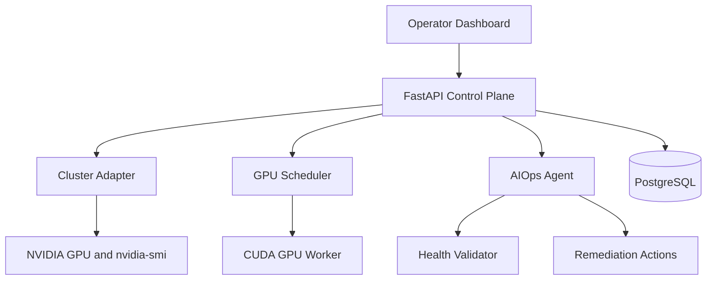
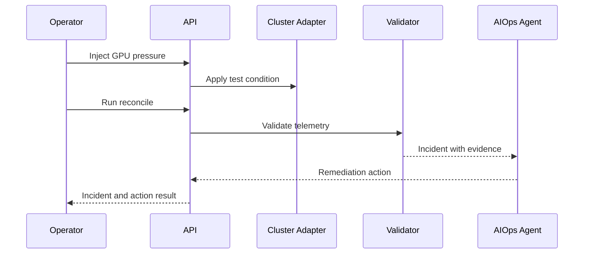
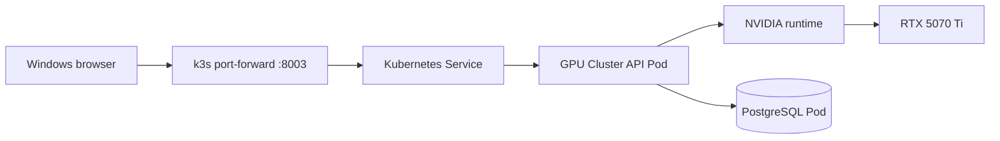
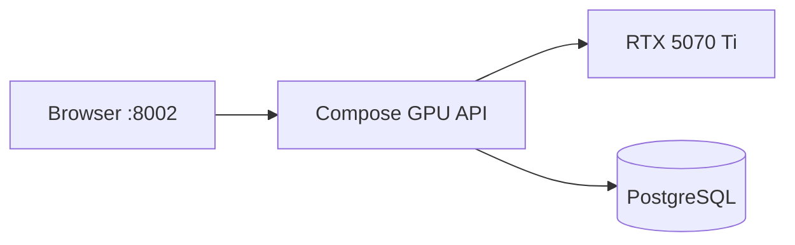
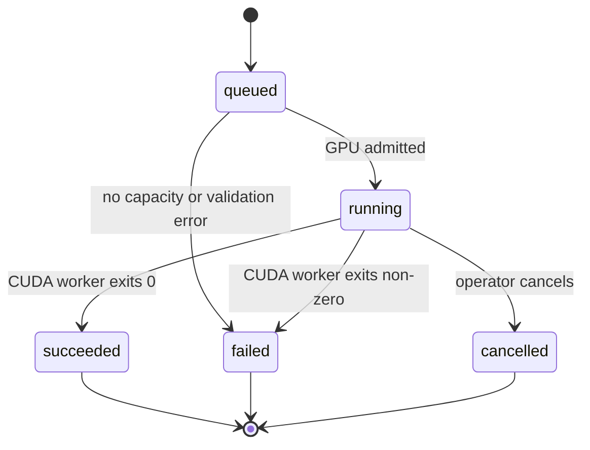
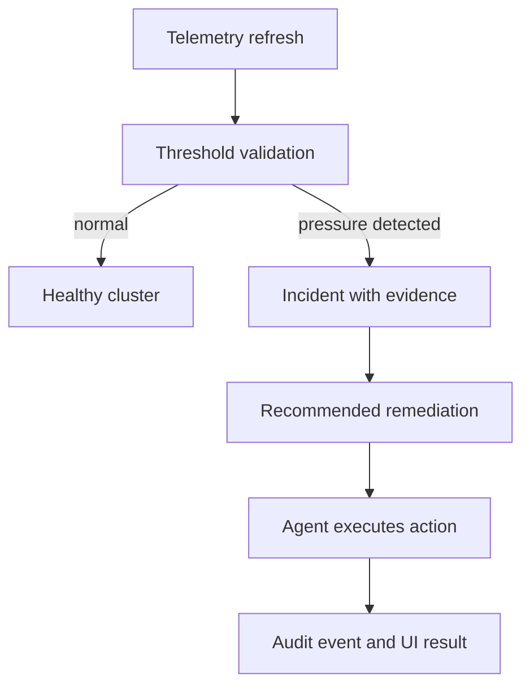

# System Architecture

## 1. Purpose

GPU Cluster Reliability Control Plane is a control-plane application for machine-learning research infrastructure. It sits above GPU execution and Kubernetes scheduling to provide a single operational workflow for inventory, workload submission, health validation, failure injection, and automated remediation.

## 2. Logical architecture

## 3. Components

### Operator dashboard

The static dashboard is served by FastAPI. It polls health, node, and job endpoints and provides actions for submitting CUDA jobs, starting execution, injecting GPU pressure, and reconciling incidents.

### FastAPI control plane

`app/api.py` is the HTTP boundary. It coordinates authentication, cluster health, node inventory, job submission, CUDA execution, failure injection, AIOps reconciliation, persistence, and metrics.

### Cluster adapter

`app/cluster.py` supports two behaviors:

- `CLUSTER_MODE=real`: executes `nvidia-smi` and maps the result to a node and GPU model;
- `CLUSTER_MODE=simulated`: creates deterministic simulated nodes for local development.

The adapter refreshes telemetry before health and inventory responses. This keeps the UI view close to the actual GPU state.

### Scheduler

`app/scheduler.py` performs simple GPU-aware admission control:

1. accept a job with GPU count and priority;
2. select a ready node with available capacity;
3. assign the job and mark it running;
4. launch the CUDA worker when requested;
5. mark success or failure from the process return code;
6. release the GPU allocation.

### CUDA worker

`app/gpu_worker.py` is the execution path for a dashboard-launched workload. It runs inside the CUDA-enabled image and performs a GPU matrix-multiplication smoke test. `training/train.py` provides a Kubernetes Job-oriented training smoke workload.

### Validator and AIOps agent

The validator examines node and GPU conditions and produces incident evidence. The AIOps agent reconciles those incidents into actions. For the demo, high GPU memory pressure produces a warning and recommends `drain_node_and_clear_workloads`.

The workflow is intentionally explicit:

### PostgreSQL

`app/persistence.py` stores jobs, incidents, and audit events. PostgreSQL runs as a StatefulSet in Kubernetes and as a service in the Compose deployment.

### Reliability controller

`controllers/reliability_controller.py` is the Kubernetes-facing controller process. It is deployed with a service account, ClusterRole, and ClusterRoleBinding so the project can evolve toward watching cluster objects and reconciling reliability state outside the API process.

## 4. Deployment topologies

### Native k3s with real GPU

The native k3s path uses:

- WSL2 Ubuntu as the Linux host;
- k3s containerd;
- NVIDIA Container Toolkit;
- NVIDIA device plugin;
- `RuntimeClass` named `nvidia`;
- Kubernetes resource limit `nvidia.com/gpu: "1"`.

The device plugin registers the GPU as a Kubernetes extended resource. The API Pod receives the GPU through the runtime class and resource limit, and `nvidia-smi` inside the Pod reports the physical RTX 5070 Ti.

### Docker Compose

Compose is useful for fast iteration and a compact GPU demo. Kubernetes is the stronger recruiter demonstration because it adds declarative deployment, RBAC, Services, StatefulSets, device-plugin resource registration, and reconciliation concepts.

## 5. Workload lifecycle

## 6. Failure and remediation lifecycle

## 7. Security boundaries

- FastAPI routes can require authenticated roles for operational actions.
- Kubernetes controller permissions are scoped through a ServiceAccount, ClusterRole, and ClusterRoleBinding.
- GPU workloads are isolated by container boundaries and Kubernetes resource requests.
- PostgreSQL credentials are supplied through Kubernetes configuration and should be moved to a secret-management system for production.
- The local recruiter demo disables authentication for a frictionless dashboard walkthrough; production deployments should enable it.

## 8. Observability and operational evidence

The project is designed to be demonstrated through evidence:

- `nvidia-smi` proves physical GPU access inside the workload container;
- `/api/v1/nodes` proves inventory and telemetry discovery;
- job state transitions prove workload lifecycle handling;
- incident evidence proves threshold-based detection;
- reconciliation output proves automated remediation;
- PostgreSQL audit rows prove the control plane records operational actions;
- Kubernetes events prove scheduling, image, runtime, and resource behavior.

## 9. Design tradeoffs

The implementation intentionally keeps the scheduler and process registry compact so it can run on one workstation. It demonstrates the control-plane patterns without pretending to be a full Slurm or Kubernetes replacement. In a production evolution, the in-memory scheduler state would become durable and reconciled, the controller would watch Kubernetes resources, and the remediation layer would use idempotent workflows with retries and safety gates.
